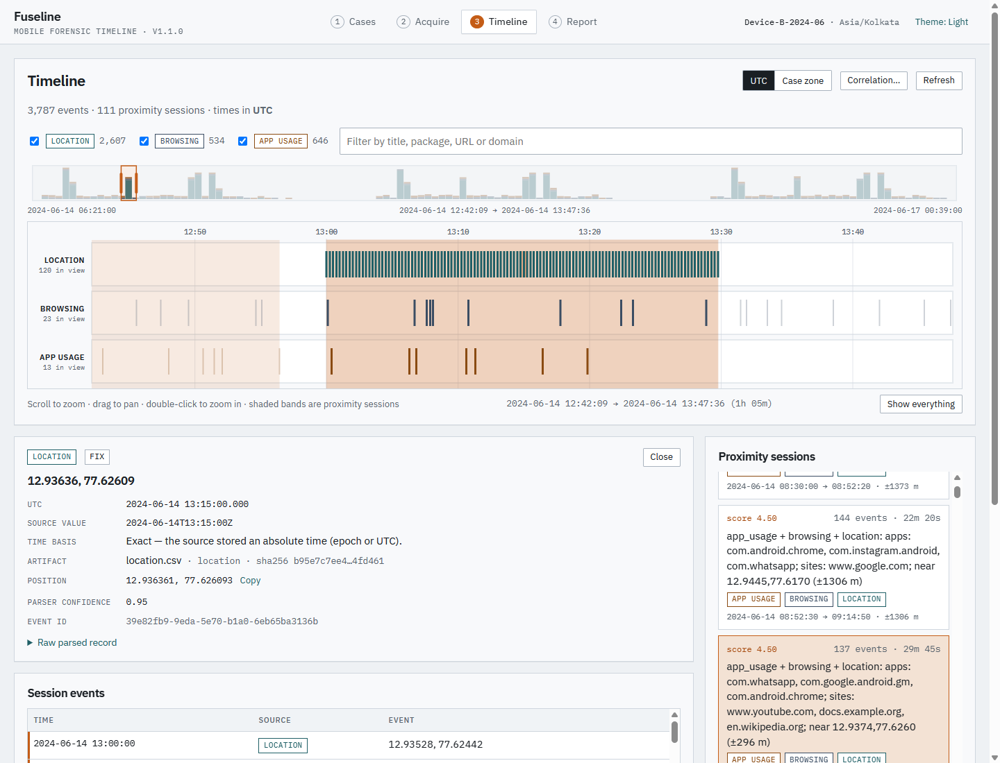
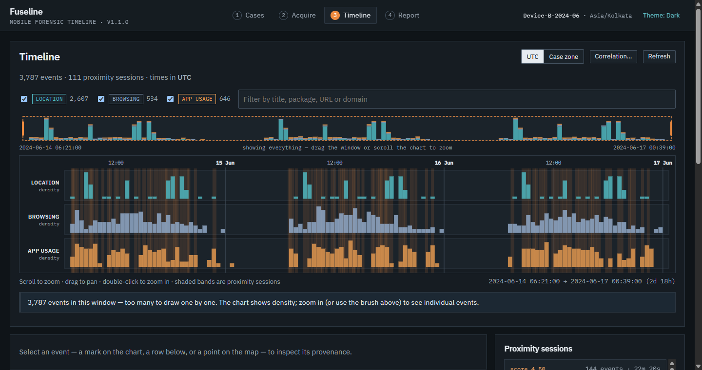

# Fuseline

Correlate **location data**, **browsing history**, and **app usage logs** into a unified UTC forensic timeline. Fuseline surfaces **proximity sessions** where those sources coincide in time, with full artifact provenance and a tamper-evident chain of custody.

Workflow: **Acquisition → Analysis → Validation → Report**



| Service | URL (dev) | URL (single process / Docker) |
|---------|-----------|-------------------------------|
| UI | http://127.0.0.1:5173 | http://127.0.0.1:8000 |
| API | http://127.0.0.1:8000 | http://127.0.0.1:8000 |
| OpenAPI | http://127.0.0.1:8000/docs | http://127.0.0.1:8000/docs |

---

## Problem statement

> Correlate location data, browsing history, and app usage logs into a unified forensic timeline.

| | |
|---|---|
| **Objective** | Chronological view of mobile activity across multiple artifact sources |
| **Stack** | Python, SQLite, optional Plaso import |
| **Approach** | Extract timestamps → normalize to UTC → correlate events → unified timeline |
| **Output** | Unified mobile forensic timeline with correlated sources |

---

## Features

**Acquisition**
- Case management with examiner metadata, a device timezone, and per-case SQLite storage
- Format detection by **content**, never by file name; upload several files at once
- SHA-256 hashing, duplicate detection, **read-only** evidence copies, integrity re-verification
- Rows that cannot be parsed are skipped **and counted** (with reasons), never silently dropped

**Analysis**
- Zoomable, pannable swimlane timeline (Location / Browsing / App usage) over a whole-case overview brush; handles tens of thousands of events by switching to density view when zoomed out
- Proximity sessions drawn as bands across the lanes, with a location track (offline, no map tiles), spread radius, and per-event provenance
- UTC or case-timezone display; every event records *how* its UTC time was derived (`absolute`, `offset`, or `assumed`)
- Configurable correlation window, minimum sources, and maximum session length

**Validation & reporting**
- Validation findings: coverage, skipped rows, assumed timezones, gaps, sources that never overlap in time, implausible dates
- Self-contained HTML report (inline SVG chart, no scripts), CSV and lossless JSON exports
- Append-only, hash-chained audit log; the HTML report includes the chain of custody

**Also**: light/dark themes, keyboard-accessible chart and tables, fonts bundled (no third-party requests), bundled sample evidence plus a 3-day, ~3,800-event generator.



---

## Quick start

```bash
git clone https://github.com/navneetxdd/fuseline.git
cd fuseline
```

### Dependencies

- Python 3.11+
- Node.js 22.12+ (20.19+ is enough to run and build the UI; the test runner needs 22.12+)

### Development (API auto-reload + Vite UI)

**Windows (PowerShell)**

```powershell
.\scripts\run_dev.ps1
```

**Linux / macOS**

```bash
bash scripts/run_dev.sh
```

The script creates `.venv`, installs dependencies, seeds the sample evidence, installs the UI, and starts both servers. Open http://127.0.0.1:5173. (If port 5173 is busy Vite picks the next one; Fuseline accepts any loopback origin.)

<details>
<summary>Manual setup</summary>

```powershell
python -m venv .venv
.\.venv\Scripts\pip install -r requirements-dev.txt     # Linux/macOS: .venv/bin/pip
python scripts\seed_demo.py                              # (sample evidence is already in the repo)
cd frontend; npm install; cd ..
.\.venv\Scripts\python -m uvicorn app.main:app --reload --app-dir backend
cd frontend; npm run dev
```

</details>

### Single process (build the UI once, serve everything from FastAPI)

```powershell
.\scripts\run_prod.ps1            # Windows;  -Port 9000 to change the port, -Rebuild to force a UI rebuild
```
```bash
bash scripts/run_prod.sh          # Linux/macOS; optional port argument, REBUILD=1 to force a UI rebuild
```

### Docker

```bash
docker compose up --build         # http://localhost:8000, data kept in the fuseline-data volume
```

The compose file publishes the port on loopback only: Fuseline has no login (see [Security](#security-model)).

---

## Application workflow

1. **Cases** — enter a case name, examiner and the **device timezone** (used only for timestamps that carry no timezone), then *Create & acquire*.
2. **Acquire** — drop evidence files (or *Load sample evidence*), or under **App usage** use *Detect device…* to pull live app-usage via project-local `adb` (`tools/platform-tools/`, installed by `scripts/ensure_platform_tools.py` / `run_dev`). Browsing and location still need uploaded files. *Verify integrity* re-hashes every stored copy and checks the audit chain.
3. **Timeline** — scroll to zoom, drag to pan (or drag the overview window); click a mark, a table row or a map point to inspect it. Click a proximity session to zoom to it and highlight its members on the chart and map. *Correlation…* changes how sessions are built.
4. **Report** — review validation findings, sessions and the chain of custody; export HTML, CSV or JSON.

### Recommended walkthrough

1. **Cases** → create a case → *Create & acquire*
2. **Acquire** → *Load sample evidence* (15 events, 4 artifacts, 4 proximity sessions) → *Verify integrity*
3. **Timeline** → click a session card → click a mark or a map point to inspect the event and its provenance
4. **Report** → export HTML (and optionally CSV / JSON); note the chain of custody at the end of the HTML report

Try it at scale: `python scripts/seed_demo.py --large` writes a three-day sample (~3,800 events) to `samples/large_demo/`; upload those three files into a case. The UI and API have been exercised with 60,000 events (ingest in a few seconds; each timeline query well under a second).

---

## Evidence formats

Formats are recognised from file **content** (SQLite schema, CSV header, XML/JSON structure). The *source hint* on the Acquire page only narrows which parsers are tried.

| Source | Formats |
|--------|---------|
| Browsing | Chromium / Chrome / Edge `History` (visits with decoded transition types, search terms, downloads); Firefox / Firefox for Android `places.sqlite` |
| App usage | Android UsageStats: SQLite (`events` + `packages`), ALEAPP-style CSV, UsageStats XML; event types decoded (foreground, background, screen on/off, …) |
| Location | CSV or SQLite with latitude / longitude / time columns; **GPX**; **Google Takeout** `Records.json` |
| Plaso (optional) | `psort` L2TCSV and JSON-lines output; honours the timezone declared per row; mapped onto the lanes above |

Not supported (export to one of the formats above first): raw UsageStats protobuf files, Chromium WAL sidecars (upload a checkpointed `History`), iOS databases.

Sample artifacts live in `samples/demo_case/` (regenerate with `python scripts/seed_demo.py`): `app_usage.db`, `History`, `location.csv`, `plaso_sample.l2t.csv` → 15 events, 4 artifacts, 4 proximity sessions.

### Plaso

Plaso is not required. To bring in a Plaso timeline:

```bash
log2timeline.py --storage-file evidence.plaso /path/to/extraction
psort.py -o l2tcsv -w timeline.l2t.csv evidence.plaso        # or: -o json_line
```

Upload the resulting file on Acquire.

---

## How it works

```
Acquire → hash → detect format → parse (skips counted) → normalise to UTC → SQLite events
                                                       → validation findings
                                                       → proximity sessions
UI / report exports ← FastAPI
```

### Time handling

Every event stores its UTC time, the original source value, and a **basis**:

| Basis | Meaning |
|-------|---------|
| `absolute` | Epoch numbers, or strings marked `Z`/UTC — exact |
| `offset` | Strings with an explicit offset (e.g. `-05:00`), converted |
| `assumed` | No timezone in the source; interpreted in the **case timezone** and flagged (`TZ_ASSUMED` finding) |

Confirm the device timezone before relying on cross-source ordering of `assumed` events.

### Proximity sessions

Events are sorted by UTC time and chained into a cluster while each is within the **window** (default 300 s) of the previous one. A cluster becomes a session when it contains at least **2 distinct sources**; clusters longer than the **maximum length** (default 30 min) are split at their widest pauses. Every event belongs to at most one session, results are independent of input order, and session IDs are deterministic. Score = distinct sources + 0.5 if a location source is present + min(1, events/10). Sessions show *temporal coincidence*, not causation.

### Integrity

- Uploads are hashed, copied, re-hashed, and the copy is made **read-only**.
- Event IDs are deterministic (`sha256(artifact) + row`), so re-ingesting the same evidence elsewhere reproduces the same IDs.
- The audit log chains each entry to the previous entry's hash. *Verify integrity* recomputes the chain and re-hashes the stored evidence.

---

## API

Interactive reference: http://127.0.0.1:8000/docs

| Method | Path | Purpose |
|--------|------|---------|
| GET | `/api/health`, `/api/meta` | Liveness; version, upload limit, supported formats |
| GET / POST | `/api/cases` | List / create cases |
| GET / PATCH / DELETE | `/api/cases/{id}` | Read / edit / delete a case |
| POST | `/api/cases/{id}/acquire` | Upload an artifact (multipart: `file`, optional `source_hint`) |
| POST | `/api/cases/{id}/acquire/demo` | Load the bundled sample pack |
| GET | `/api/cases/{id}/artifacts` | Artifact inventory |
| POST | `/api/cases/{id}/verify` | Re-hash stored evidence and verify the audit chain |
| GET | `/api/cases/{id}/audit` | Chain-of-custody entries |
| GET | `/api/cases/{id}/timeline` | Events; `source`, `q`, `start`, `end`, `offset`, `limit`, `order` (`total` and `has_more` are always returned) |
| GET | `/api/cases/{id}/events/{event_id}` | One event |
| GET | `/api/cases/{id}/overview` | Per-source counts in time buckets (for the overview and density view) |
| GET | `/api/cases/{id}/locations` | Location fixes, evenly down-sampled |
| GET | `/api/cases/{id}/sessions` | Proximity sessions |
| GET | `/api/cases/{id}/sessions/params` | Correlation parameters in effect |
| POST | `/api/cases/{id}/sessions/rebuild` | Rebuild with `window_seconds`, `max_span_seconds`, `min_sources` |
| GET | `/api/cases/{id}/sessions/{session_id}/events` | A session's member events |
| GET | `/api/cases/{id}/validation` | Validation findings (`?refresh=true` recomputes) |
| GET | `/api/cases/{id}/report` | Report summary (JSON) |
| GET | `/api/cases/{id}/report/html` | Self-contained HTML report |
| GET | `/api/cases/{id}/report/csv` | CSV (`?raw=true` disables formula neutralisation) |
| GET | `/api/cases/{id}/report/json` | Lossless JSON export incl. audit trail |

---

## Configuration

Environment variables (all optional):

| Variable | Default | Purpose |
|----------|---------|---------|
| `FUSELINE_DATA_DIR` | `./data` | Case databases, evidence copies and the audit log |
| `FUSELINE_MAX_UPLOAD_MB` | `64` | Per-file upload limit |
| `FUSELINE_ADB` | _(auto)_ | Absolute path to `adb` if you do not want the bundled `tools/platform-tools/` binary |
| `FUSELINE_ALLOWED_HOSTS` | `127.0.0.1,localhost,[::1]` | `Host` values the API answers; `*` disables the check |
| `FUSELINE_ALLOWED_ORIGINS` | *(empty)* | Extra browser origins allowed to make state-changing requests |
| `FUSELINE_ALLOW_LOOPBACK_ORIGINS` | `1` | Trust any `http(s)://localhost:*` / `127.0.0.1:*` origin (e.g. the Vite dev server); `0` restricts to same-origin plus the list above |
| `FUSELINE_API` | `http://127.0.0.1:8000` | API target of the Vite dev proxy (frontend only) |

---

## Security model

Fuseline is built for a **local examiner workstation**. It has no login, so anything that can reach the port can read and delete cases: keep it on loopback and do not expose it to a network. It is not multi-tenant hosting.

Because evidence is untrusted input and the API has no login, the following are enforced:

- **`Host` allow-list** (DNS-rebinding defence) and an **`Origin` check on state-changing requests** (cross-site form/`fetch` defence); CORS is not wildcard and never allows credentials.
- **HTML report**: all evidence strings are escaped, and the response carries `Content-Security-Policy: default-src 'none'` (no scripts). Titles and package names in evidence can be attacker-controlled.
- **CSV export** prefixes cells that would run as spreadsheet formulas; the JSON export is byte-faithful.
- **The UI never makes an evidence URL clickable** (they are shown defanged with a Copy button) and strips control / bidirectional-override characters from event titles.
- **Hostile files**: SQLite evidence is opened read-only and `immutable` with a query time budget and quoted identifiers; XML is parsed with `defusedxml` (entity bombs refused); uploads are size-capped, filenames sanitised, paths confined under the data directory.
- Security headers (`nosniff`, `no-referrer`, `X-Frame-Options: DENY`, `Cache-Control: no-store` on API responses); the UI's CSP forbids inline scripts and third-party origins.

Fuseline's parsers are a convenience for triage and correlation; corroborate significant findings with a second, validated forensic tool before relying on them.

---

## Repository layout

```
backend/app/         API routers, parsers, pipeline (normalise / correlate / validate), report templates
backend/tests/       pytest suite (unit + API integration, incl. regression tests for past defects)
frontend/src/        React UI: pages/, components/, lib/ (time & map maths), api/, state/
samples/demo_case/   Small demo evidence fixtures
scripts/             seed_demo.py, run_dev / run_prod (.ps1, .sh)
docs/                Problem statement, screenshots
data/                Runtime case DBs, evidence copies, audit log (gitignored)
```

## Development

```bash
# backend
pip install -r requirements-dev.txt
pytest -q
ruff check backend scripts && ruff format --check backend scripts
mypy

# frontend
cd frontend
npm run lint        # oxlint
npm run typecheck
npm test
npm run build
```

CI (`.github/workflows/ci.yml`) runs all of the above on Python 3.11–3.13 and Node 22, and smoke-tests the Docker image.

## Acknowledgments

Parser schemas informed by Plaso and ALEAPP. Related prior art: imcom/Android-forensic-timeline. No third-party forensic engines are vendored here.

## License

MIT — see [LICENSE](LICENSE).
